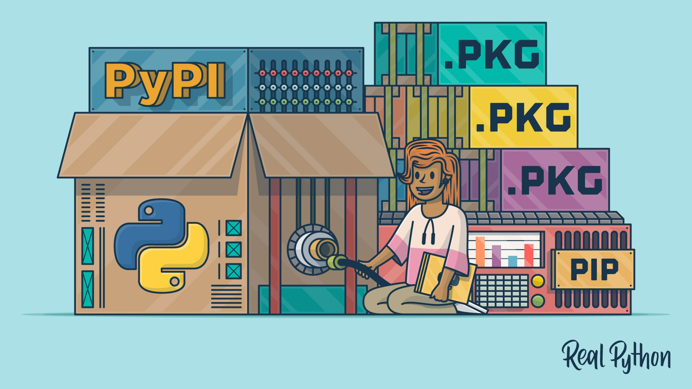
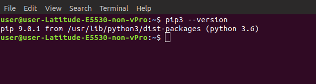
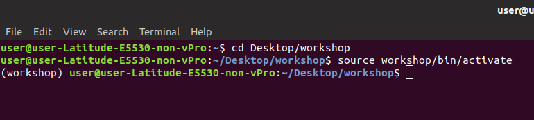
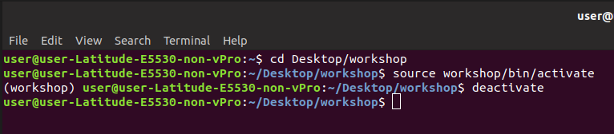
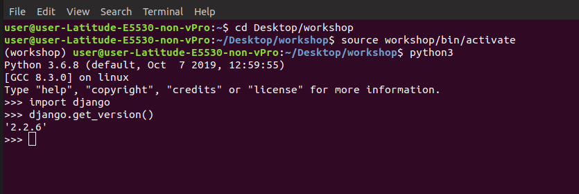
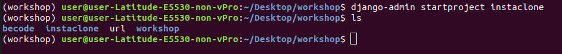
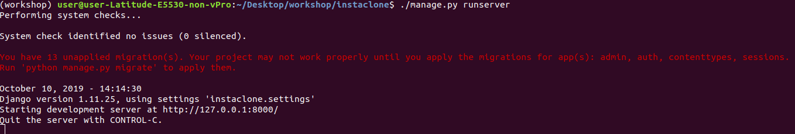
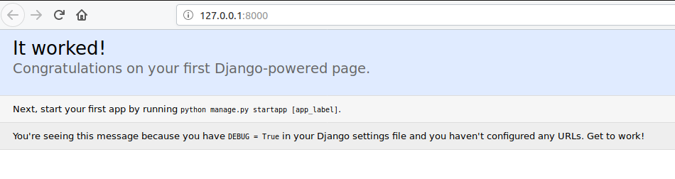
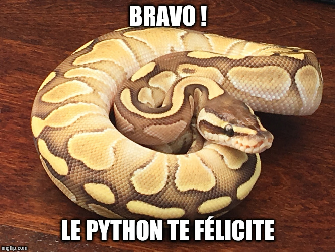

# Workshop Django

1. [Installation de Python-Django](README.md)
2. [Création de l'app](instaclone/creationappli.md)
3. [Structure](instaclone/structure.md)
4. [Media](instaclone/media.md)
5. [PostgreSQL](postgresql.md)
6. [CSS](instaclone/css.md)
7. [Formulaire](instaclone/formulaire.md)
## Qu'est-ce que Django ?
* Il s'agit du framework web Python le plus populaire avec `Flask`. Il est notamment utilisé par Pinterest, Instagram, Eventbrite et mozilla.
  
* Django est basé sur une architecture MVT, elle-même dérivée de l'architecture MVC. 

* Il est réputé rapide pour qui sait l'utiliser.
* Framework sécurisé

* C'est un framework scalable ; c'est-à-dire qu'il peut facilement grandir en même temps que le projet en rajoutant des apps au fur et à mesure.

## Qu'est-ce que l'architecture MVT ?
Le MVT est un design pattern qui signifie `Modèle` - `Vue` - `Template`.

Le but d'un design pattern est d'organiser son code source en fonction d'une logique bien précise.

En l'occurence, le but du MVT est de séparer la logique du code en trois parties que l'on retrouve dans des fichiers distincts.

### 1. Modèle

Le modèle interagit avec la base de données. Sa mission est de chercher dans une base de donnée les items correspondant à une requête et de renvoyer une réponse facilement exploitable par le programme.

La consultation d'une base de données relationnelle se réalise par un langage appelé SQL (Structured Query Language). Sa syntaxe est très différente de Python ! 

Un ORM (Object Relational Mapping, ou Mapping objet-relationnel en français) est donc inclus dans le modèle pour traduire les résultats d'une requête SQL en objets Python avec lesquels il peut interagir. De même, il permet d'écrire une requête SQL directement en Python. Un peu comme un traducteur automatique !

Dans un projet Django, chaque application contient un document `models.py` qui réunit les différents modèles utilisés.

### 2. Template

Un template est un fichier HTML qui peut recevoir des objets Python et qui est lié à une vue (nous y reviendrons). Il est placé dans le dossier `templates`.

Le template se concentre essentiellement sur l'affichage. il ne fait presque aucun calcul et se contente de récupérer des variables pour savoir ce qu'il doit afficher. 

Par exemple, nous pouvons "donner" la variable `tom="Tom"` au template `index.html` et ce dernier l'affichera à la place du prénom.

### 3. Vue

La vue joue un rôle central dans un projet structuré en MVT : sa responsabilité est de recevoir une requête HTTP et d'y répondre de manière intelligible par le navigateur.

La vue réalise également toutes les actions nécessaires pour répondre à la requête :

Si une interaction avec la base de données est requise, la vue appelle un modèle et récupère les objets renvoyés par ce dernier.

Si un template est nécessaire, la vue l'appelle.

Dans un projet Django, les vues de chaque application sont regroupées dans le document `views.py`.

Chaque vue est associée à une url. Les urls d'un projet sont regroupées dans le fichier `urls.py`.

>Pour aller plus loin, 
https://openclassrooms.com/fr/courses/4425076-decouvrez-le-framework-django/4631014-decouvrez-larchitecture-mvt

### Comparaison avec le MVC

Comme mentionné plus haut, le pattern MVT s'inspire du pattern MVC.

Si tu as déjà des notions en MVC, fais bien attention à ne pas confondre ces deux modèles. En effet, une vue en MVT n'est pas du tout la même chose qu'une vue en MVC.

Si cette affirmation t'a fait bugger, remonte la page et relis la description du MVT^^.

# Installation
## Python
Si tu es sur pc ou Mac, télécharge et installe Python : 
https://www.python.org/

Pour les adeptes d'Ubuntu,

    sudo apt-get update

    sudo apt-get install python3.x

Fais bien attention d'installer python 3 et non pas python 2 sans quoi certaines choses seront différentes. La doc officielle recommande d'ailleurs de n'utiliser que python 3 à partir de janvier 2020.

Pour vérifier ta version, va dans invite de commande et tape : 

    python3 --version

 ou alors

    python3 -v 

Ce qui te donnera quelque chose dans ce genre là :

## Ceci n'est pas une pip

Pip est un gestionnaire de package utilisé pour installer et gérer des packages et librairies écrits en langage Python.

C'est l'équivalent du npm de javascript.

Nous utiliserons donc pip pour installer le package Django.

Depuis python 3.4, pip est inclus par défaut dans l'installateur python.

Une petite vérification ne faisant jamais de mal, tape ceçi dans ton invite de commande :

    pip --version

ou 

    pip -v

>Plus d'infos sur pip si tu veux aller plus loin :
https://realpython.com/what-is-pip/#conclusion-what-is-pip
## Ton environnement virtuel

Parti pour installer Django ? Minute papillon !

Il est de bonne pratique de ne pas installer Django directement sur sa machine mais de l'installer dans un environnement virtuel. 

Késako ? 

De base, quand tu installes des packages python, ceux-ci seront tous installés dans le même dossier commun même si tu les utilises pour des projets différents. Ce qui peut parfois créer des conflits entre ses dépendances...

Le but d'un environnement virtuel est de créer un environnement totalement isolé du reste de l'ordinateur pour chaque projet python. 

Les dépendances de tes projets seront donc installés dans des dossiers séparés.
Celà te permet d'installer tous les packages nécessaires à chacun de tes projets sans qu'il finisse par y avoir des conflits entre les dépendances de projets différents.
Tu peux même utiliser des versions différentes de python pour chaque projet si tu en as envie.

Fondamentalement, un environnement virtuel n'est qu'un dossier avec quelques scripts. Tu peux donc en créer autant que tu tu veux avec quelques lignes de commande.

> Attention, c'est ici que des différences apparaissent entre python 2 et 3 au niveau des lignes de commandes. Donc si tu n'es pas en python 3, update ta version.

    python3 -m venv nomdetonenvironnement

La commande `"-m"` signifie que tu veux télécharger le module `"venv"` ; c'est-à-dire le module "virtual environment".

Dans mon cas, j'ai appelé mon environnement `"workshop"` mais tu es libre de l'appeller comme tu veux.

Ce qui donne chez moi : 

    python3 -m venv workshop

Le module `venv` est inclus à partir de python 3.4. 

Si tu es sur une version antérieure, tu devras l'installer via `pip`.

        pip install virtualenv

        virtualenv nomdetonenvironnement

Maintenant que ton environnement est créé, il ne te reste qu'à l'activer.
Va dans le dossier de ton projet et tape ceçi :

    source nomdetonenvironnement/bin/activate

ou bien

     ./nomdetonenvironnement/bin/activate

Chez moi, ça donne ça :

Si tu es sous windows, tape ceçi :

    nomdetonenvrionnement\Scripts\activate.bat

Tu remarqueras que le nom de ton environnement apparait désormais devant ton user. Toutes tes futures lignes de commandes prennent donc uniquement cours dans ce dossier.

>A noter que dans mon exemple, le mot "workshop" apparait 2 fois. C'est uniquement parce que le dossier de mon projet porte le même nom que mon environnement.
>Sorry pour la confusion.

Pour le désactiver, tape simplement :
    
    deactivate

Ce qui donne :

Voilà ! En prenant cette bonne habitude, tu t'épargneras pas mal de conflits entre tes projets python voire même entre toi et tes futures clients...

Blague à part, installons enfin Django dans cette environnement virtuel.

>Pour aller plus loin : https://realpython.com/python-virtual-environments-a-primer/

## Django

Tape ceçi pour installer la dernière version en date de Django: 

    pip install django

Lorsque tu installes python, tu installes également l'invite de commande (le shell) de python.

Retourne dans ton environnement virtuel et accède au shell python en tapant tout simplement :
    
    python

Ce nouveau shell te servira à créer tes projets. 

tape :
    
    import django

Si tu n'as pas de message d'erreur, c'est que tout s'est correctement installé. Bravo !

tape encore :

    django.get_version()

Et tu connaitras ta version de Django.

Chez moi, ça donne ça :

Pour quitter ce shell, tape :

    quit() ou exit() ou encore ctrl d

## Création du projet instaclone

Quitte le shell python et crée le projet instaclone via cette ligne de commande :

    django-admin startproject instaclone

>Note : si tu n'es pas dans ton environnement virtuel, cette commande ne fonctionnera pas. Pourquoi ? Parce que tu as installé Django au sein de cet environnement uniquement. Il n'est donc pas accessible de l'extérieur. C'est tout l'intérêt de l'environnement virtuel.

Django-admin est l’utilitaire en ligne de commande de Django pour les tâches administratives. tu ne t'en serviras qu'à la création du projet.

> Si tu veux creuser l'utilitaire admin, https://realpython.com/manage-users-in-django-admin/

Tu peux ensuite taper :

    ls

Ce qui affiche le contenu du répertoire que tu viens de créer.

Ce qui donne ceçi :

>J'ai également un dossier becode qui n'apparaitra pas chez toi. Tu ne devrais avoir que "instaclone url wokshop".

Pour finir, tape :

    cd instaclone
    
    code .

Tu devrais normalement avoir lancé Vs code et ouvert ton projet.
Si tu utilises un autre éditeur de code, le raccourci sera évidemment différent. 
Je te te laisse te renseigner ^^

Dans vs code, tu devrais voir un fichier `manage.py`. C'est via ce fichier que tu vas gérer ton projet dans l'invit de commande désormais.

## Lance ton serveur

Pour lancer ton serveur, tape : 

    ./manage.py runserver

Ce qui donne ceçi :

Rends-toi sur ton localhost (8000 dans cet exemple) et tu devrais avoir ta première page en python !

Tu peux maintenant passer au tuto d'Intaclone : [Instaclone](instaclone/creationappli.md).
# Pour Aller plus loin

- (énorme ressource en anglais pour python) https://realpython.com/
- (tuto youtube en français) https://www.youtube.com/watch?v=SjRlmyEVXq4 
- (open classrooom) https://openclassrooms.com/fr/courses/4425076-decouvrez-le-framework-django
