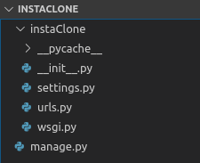

# La création d'application

Quand on lance un projet, un dossier se crée, ainsi qu'un sous-dossier du même nom. Pour créer une application (un blog, une page e-commerce, etc) dans ce projet, on tape la commande suivante à la racine, où se trouve `manage.py`:

    ./manage.py startapp gallery

Si vous êtes curieux, je vous invite à lire ce qui suit. Sinon, scrollez jusqu'à l'image du paresseux. 

Voici l'arborescence du projet avant d'installer l'application:

Á la racine, on a donc `manage.py`, qui est le script de gestion du projet, et qu'on va appeler à chaque fois qu'on veut faire tourner le serveur. 

Dans le sous-dossier du projet, on y voit:
-  `__init__.py`: un fichier qui initialise un paquet et dit à python de traiter les sous-dossiers comme des modules (en gros). 
- `settings.py` contient toute la configuration de base du projet.
`urls.py`:  la configuration des urls, of course.
- `wsgi.py`: on se s'en occupe pas pour le moment, c'est pour déployer le projet sur d'autres serveurs.

Allons maintenant fouiller dans le dossier de l'application, qui apparait après qu'on ait executé la commande `startapp`: 

Tout d'abord, on y voit un dossier "migrations", qui permet à Django de migrer d'un coup de baguette magique le code python à la base de donnée. Ensuite, nous avons

 - `admin.py`: permet d'ajouter, supprimer, et modifier du contenu dans l'interface admin de Django. 
 - `apps.py`: où se trouvent les classes de configurations spécifiques à chaque application.
 - `models.py`: code qui communique avec la base de données et
 - `views.py`: code de gestion des requêtes/réponses. Mai
 - `tests.py`: pour automatiser les tests dans le code et éviter les bugs. On ne le verra pas dans ce tutoriel. 
 
 mais où allons-nous mettre le code HTML, les templates? Vous allez voir :) 

Coucou toi! Bien dormi? On reprend! 

Après avoir installé l'application, et pour que tout fonctionne bien, on l'indique dans `settings.py` dans le dossier du projet:

    'gallery.apps.GalleryConfig', 

