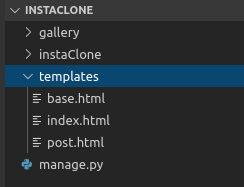
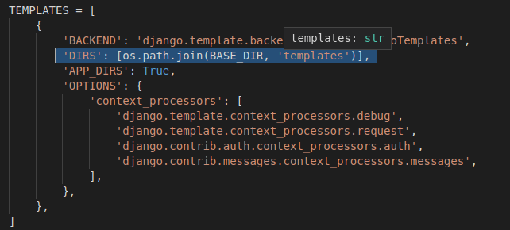

# lLes fichiers template

On va commencer par créer les fichiers templates qui contiendront l'HTML ainsi que le code de la template engine de Django. Créez cette arborescence : 



Pour que django les retrouve quand on les appelle, il va falloir lui indiquer où aller dans le fichier `settings.py`: 

    'DIRS': [os.path.join(BASE_DIR, 'templates')], 



Dans le fichier `index.html` qu'on vient de créer, on va afficher un simple :

    <h1>Hello World</h1>

# La page d'accueil

Pour le petit rappel, les fichiers Views sont à Django ce que les controlleurs sont à Laravel. C'est à dire qu'ils servent d'entremetteurs entre les requêtes et les réponses. 

On va faire simple au départ, sans données externes, pour comprendre la base. On va importer le module 'render' qui permettra tout simplement d'afficher la template `index.html`:

`gallery/views.py`:

    from django.shortcuts import render

    def home(request):
        return render(request, 'index.html)

Par contre, pour les URLS, nous devons passer par le fichier `urls.py` du dossier projet avant d'éditer celui de l'application.

`instaClone/urls.py`:

    from django.contrib import admin
    from django.urls import path, include


    urlpatterns = [
        path('admin/', admin.site.urls),
        path('', include('gallery.urls')),
    ]

Les imports :

- **admin**: module qui permet de modifier certaines données dans l'interface admin
- **path**: pour pouvoir définir les chemins et la "view" qu'il renvoie.
- **include**: pour inclure les urls des applications (dans ce cas, l'application gallery)

Si on analyse cette partie du code :

    path('', include('gallery.urls')),

On peut voir que les chemins des urls de gallery seront inclus à la racine du projet ('')

On va ensuite éditer le fichier urls.py de l'application même:

`gallery/urls.py`:

    from django.urls import path
    from . import views

    app_name="gallery"

    urlpatterns = [
        path('', views.home, name="index"),
    ]

- On importe les views pour pouvoir l'utiliser dans le "path".
- A la racine des urls de gallery, qu'on a inclus dans la racine des urls du projet, on appelera la fonction "home" dans "views".


Maintenant que l'URL est configuré et que le `views.py` renvoie la template, vous pouvez tester cela:

    ./manage.py runserver

Vous devriez avoir "hello world" quand vous cliquez sur http://127.0.0.1:8000/.

# La page pour poster des photos

Nous allons maintenant préparer la page d'upload et le lien vers celle-ci.

Ajoutons d'abord le lien dans `urls.py`:

      path('post/', views.post, name="post")


Quand on tapera http://127.0.0.1:8000/post ou qu'on cliquera sur un lien qui s'y dirige, cela appelera la fonction "post" dans `views.py`, qui renverra le template `post.html`.

Il faut donc définir celle-ci :

    def post(request):
        return render(request, 'post.html')

Ecrivez ce que vous voulez dans `post.html`. Pour voir si ça marche, rdv sur http://127.0.0.1:8000/post.

Si ça marche, on peut continuer (sinon, demandez à Corentin). 

On va faire un dernier truc assez basique avant de commencer les choses sérieuses : un lien de la page d'accueil vers la page post. Comme ça, vous allez faire vos premiers pas avec la template engine de Django. Dans vos urls, vous avez défini le lien vers le post comme ceci :

     path('post/', views.post, name="post")


Vous avez donné un nom au lien :

    name="post"

Ce qui vous sera utile pour les templates.

Plus au dessus, vous avez défini le nom de l'app :

    app_name="gallery"

Grace à cela et au tag de la template engine pour y insérer des données --> , vous allez pouvoir ajouter facilement des liens. 

`index.html` : 

    <h1>Hello World</h1>

    <a href=""> clique ici pour poster </a>

Vous avez pu définir l'url avec le nom de l'app, suivi de deux points et du nom que vous avez donné au lien. Vérifiez si ça marche. :)

# la template de base

Pour faire simple, nous allons créer un template de base qu'on importera dans chaque template:

`base.html`:

```
<!DOCTYPE html>
<html lang="en">
<head>
    <meta charset="UTF-8">
    <meta name="viewport" content="width=device-width, initial-scale=1.0">
    <meta http-equiv="X-UA-Compatible" content="ie=edge">

    <title>  InstaClone  </title>
</head>
<body>

    <div class="content">
          
    </div>

<footer> &copy; Becode </footer> 
</body>
</html>
```

Dès que vous voyez les tags de la template engine, c'est qu'on peut y ajoutez du contenu différent:

``` html
<div class="content">

      

</div>
```
C'est ici qu'on inserera le contenu de nos différentes pages. Voici comment importer le layout de base et y ajouter du contenu:

```html



 InstaClone | Image Gallery 



<h1>Hello World</h1>

<a href=""> clique ici pour poster </a>



```

Regardez le résultat et faites la même chose pour `post.html`. Il n'y a pas une grande différence pour le moment mais, si vous voyez le footer, c'est que ça fonctionne.

`post.html`: 

```


 InstaClone | Image Upload 



<h1>La page des posts</h1>


``` 
