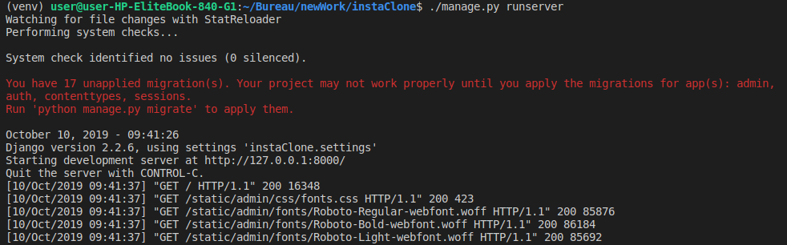
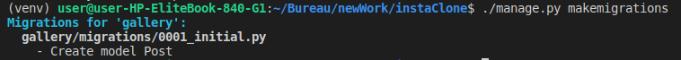
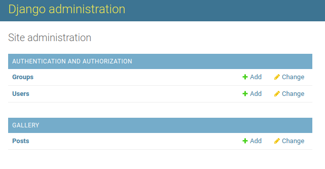

0. [Installation de Python-Django](instaclone/README.md)
1. [Création de l'app](instaclone/creationappli.md)
2. [Structure](instaclone/structure.md)
3. [Media](instaclone/media.md)
4. [CSS](instaclone/css.md)
5. [Formulaire](instaclone/formulaire.md)

## Ajoutez des médias

On arrive enfin à la partie plus visuel : l'ajout de médias. Il faut tout d'abord définir où vont être sauvegardées les images. Ensuite, on crée un dossier media et un sous-dossier images à la racine. 

Après, il faut ajouter dans `settings.py` le chemin des media_url (les liens des médias à travers http) et des media_root (les les liens des médias sauvegardés sur ordinateur).

```
MEDIA_URL = '/media/'
MEDIA_ROOT = os.path.join(BASE_DIR, 'media')
```

Il reste encore quelques configurations dans l'`urls.py` du projet. On importe le module settings :

```
from django.conf import settings
```

Et on ajoute ceci pour stocker les images en développement : 

```
if settings.DEBUG: 
    urlpatterns += static(settings.MEDIA_URL, document_root=settings.MEDIA_ROOT)
```


Nous allons maintenant enfin pouvoir créer le modèle de l'application qui communiquera avec la base de données pour afficher et stocker les images : 

`models.py`

```
from django.db import models

class Post(models.Model):
    title = models.TextField()
    cover = models.ImageField(upload_to='images/')
```

Nous avons donc importé le module "models" qui rend tout cela possible. La classe "Post" sera transferée vers postgresql grâce à la commande de migration avec comme champs "title" et "cover" qui sera sous forme d'image.  

Il faut d'ailleurs importer Pillow pour que cela fonctionne. C'est une librairie Python qui gère les images:

    $ pip install pillow


## Petit retour en arrière.... 

Quand vous avez lancé le serveur, vous avez surement remarqué quelque chose de bizarre dans le terminal.



Les 17 migrations non-effectuées font parties des bases de données propres à Django. Nous allons les migrer en même temps que le modèle que nous venons de créer :

    ./manage.py makemigrations

Vous devriez voir ceci dans le terminal :




Soyez curieux et aller voir le fichier généré dans migrations. Vous pouvez maintenant finaliser la migration en tapant :

    ./manage.py migrate

Pour vérifier si tout a fonctionné, allez sur pgadmin3, suivez ce chemin :

    mydb>schemas>public>tables>gallery_post

Clique droit + view data et vous pourrez voir les champs que vous avez créés. 

## Modification des views

Nous voulons maintenant créer plus que des pages sans dynamisme et sans âme. La première chose à faire est d'afficher des images sur la page d'accueil. Le problème, c'est que nous n'avons encore aucune image dans la base de données ! Comment faire ? Tout simplement en permettant à l'interface admin de poster des photos : 

`admin.py`:

```
from django.contrib import admin

from .models import Post

admin.site.register(Post)
```

Pour pouvoir se connecter sur l'admin, on crée d'abord un superuser :

    ./manage.py createsuper

La commande va vous demander un nom, une adresse email et un mot de passe. Le mot de passe ne peut pas être trop simple, à moins de modifier les configs dans settings.py, mais, pour le moment, ça sera plus simple d'avoir un mot de passe compliqué. :) 

Maintenant rdv sur http://127.0.0.1:8000/admin/ pour vous connecter avec votre nouveau superuser. Vous serez dirigez ici :



Félicitations, vous pouvez maintenant ajouter des images.

## Des classes à la place des fonctions


Pour pouvoir afficher facilement des images en appelant le modèle, il existe des modules pour nous rendre la vie plus facile. Voici ce que nous mettrons dans `views.py` à la place des fonctions qui renvoient simplement des templates :

```
from django.shortcuts import render
from django.views import generic
from .models import Post

class home(generic.ListView):
    model = Post
    template_name="index.html"

def post(request):
    return render(request, 'post.html')

```

On garde la fonction post pour le moment et importe donc 2 choses :

- la classe Post du modèle qui contient la base de données.
- le module "generic" qui permettra grâce à le méthode ListView l'itération de chaque image de la classe Post pour l'afficher sur la template `index.html`.

Vu que nous avons maintenant des classes, il va falloir changer légèrement l'`urls.py`:

    path('', views.home.as_view(), name="home"),

On va simplement ajouter .as_view() car home est maintenant une classe dont une certaine méthode est appelée. 

S'il n'y a pas de soucis quand on relance le serveur, c'est bien. Par contre, le visuel ne change pas car nous n'avons rien modifié dans la template `index.html`. C'est là que le template engine refait son apparition:

`index.html`:
```


<ul>



    <li>
        <a href="#">
        
        </a>
        <h2>{{ post.title }}</h2>
    </li>



</ul>


```
On remplace donc ce qu'il y avait dans le block content par ce qu'il y a au-dessus. Concrètement, l'object_list est l'objet généré par la méthode as_view() et qui contient toutes les données du modèle Post. On itère donc à travers chaque entrée et on recupère l'url (post.cover.url) pour la source de l'image et le titre. 

Bien sûr, pour l'instant, c'est moche. Et les images sont sûrement milles fois trop grandes. C'est pourquoi on va rajouter du CSS. (Là, vous pourrez faire du copier-coller en toute impunité ; n'ayez crainte.)
