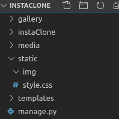

# Le CSS

Pour pouvoir ajouter du CSS et tout autre fichier statique, ajoutez ceci à la fin de `settings.py`:

    STATICFILES_DIRS = [
        os.path.join(BASE_DIR, "static")
    ]

Comme ça Django sait où aller chercher les fichiers (comme avec les médias)

Ajoutez ceci à votre arborescence (une dossier static, sous-dossier img et un fichier style.css):



Vous pourrez y mettre les images à inserer dans la template dans le dossier img.

maintenant copier-coller tout ceci dans `style.css`:


```
body {
    background: #f7c873;
    display: flex;
    flex-direction: column;
    align-items: center;
    justify-content: center;
    color: #434343;
}

.logo {
    height: 350px;
    align-self: center;
}

.logo img {
    height: 100%;
}

.content {
    width: 80%;
    display: flex;
    justify-content: center;
    overflow: hidden;
}

.content ul {
    padding: auto;
    display: inline-flex;
    flex-wrap: wrap;
    align-content: flex-start;
    margin: auto;
    justify-content: center;
   
    list-style-type: none;
}

.content ul li {
    display: flex;
    flex-direction: column;
    margin: 10px;
    height: 250px;
    width: 250px;
}

.content ul li a {
    height: 200px;
    overflow: hidden;
}

.content ul img {
    width: 100%;
    border-radius: 5px;
}

.content ul h2 {
    text-align: center;
    border-bottom: 3px groove rgba(67,67,67,0.2); 
    padding-bottom: 5px;
}

.photoAdd {
    position: absolute;
    right: 20px;
    top: 20px;
    height: 70px;
    width: 70px;
}

.photoAdd img {
    width: 100%;
    height: 100%;
}

form {
    border: 5px solid  rgba(67,67,67,0.5); 
    text-align: center;
    padding: 20px;
    width: 90%;
}

footer {
    position: absolute;
    bottom: 0;
}

#id_title {
    height: 20px;
}
```

et copier les deux images (ajoutez lien vers images dans repo) dans static/img

Parfait, maintenant il n'y a plus qu'à lier le css avec la template de base en y ajoutant ceci et le tour est joué:


- le lien vers le css dans la balise `<head>`
```
 
    <link rel="stylesheet" type="text/css" href="">
```
- le logo juste après l'ouverture de la balise `body`:
```
   <a class="logo" href=""></a>
```

et juste en dessous de ça un "block" 
addPhoto vide pour y insérer le bouton d'ajout seulement dans l'index(le bloque restera vide dans les autres templates ):

    


comme ça dans la template `index.html`, on ajoute:

```




    <a class="photoAdd" href="#">
        
    </a>


```

l'icône viendra s'insérer là où on a défini le block dans `base.html`. Il ne mène nul part pour l'instant car nous devons créer la partie "upload" dans post.html