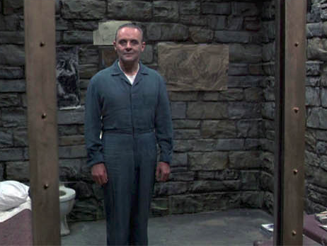

1. [Installation de Python-Django](../README.md)
2. [Création de l'app](creationappli.md)
3. [Structure](structure.md)
4. [Media](media.md)
5. [PostgreSQL](../postgresql.md)
6. [CSS](css.md)
7. [Formulaire](formulaire.md)
   
# Un petit bonus: les boutons like/dislike

Nous allons ajouter ce bouton tant convoité. Une bonne méthode pour ajouter des fonctionalités est de suivre le schéma suivant: 

**Model -> URLS -> View -> Template**

On commence par éditer le modèle. On configure ensuite les URLs, puis on met la machine en route grâce aux views et on injecte le tout dans la template. 

## `model.py`:

- On importe la timezone pour que les images restent dans l'ordre chronologique:

    from django.utils import timezone

- On ajoute les champs de like/dislike et de chronologie:
```
    like = models.IntegerField(default=0)
    dislike = models.IntegerField(default=0)
    created_at = models.DateTimeField(default=timezone.now)
```

Vous souvenez-vous de ce qu'il faut faire quand on édite le modèle pour qu'il se synchronise à la base de donnée? 




.... 


........

Toujours pas? 


Bon, voici la réponse:

    ./manage.py makemigrations

Vous pouvez aller voir le fichier dans le dossier migrations pour être sur que tout se passe bien, et ensuite:

    ./manage.py migrate


Voilààààà


## `urls.py`:

Ajoutons ceci:

```
path('like/<int:post_id>',views.like,name="like"),
path('dislike/<int:post_id>',views.dislike,name="dislike")
```

ces liens, lorsqu'ils seront appelés en cliquant sur les boutons like/dislike, définiront quel ID sera incrémenté. 

## `views.py`:
Nous devons maintenant créer les fonctions like et dislike dans `views.py`:

```
def like(request,post_id):
    post = get_object_or_404(Post,pk=post_id)
    like = post.like + 1
    Post.objects.filter(pk=post_id).update(like=like)
    return redirect("/")

def dislike(request,post_id):
    post = get_object_or_404(Post,pk=post_id)
    dislike = post.dislike + 1
    Post.objects.filter(pk=post_id).update(dislike=dislike)
    return redirect("/")
```

et importer ces modules pour que ça fonctionne:

    from django.shortcuts import redirect,get_object_or_404

## Template

Et pour finir, il faut aller injecter le tout dans la template `index.html` (juste avant la fermeture de la div 'gallery'):

```
<div class="vote">
        <a class="far like fa-thumbs-up" href=""><span>{{ post.like }}</span></a>
        <a class="far dislike fa-thumbs-down" href=""><span>{{ post.dislike }}</span></a>
        </div>
    </div>
```
et bien sûr, ajouter le lien font-awesome dans `base.html`:

        <script src="https://kit.fontawesome.com/08a7931cbe.js" crossorigin="anonymous"></script>


BRAVOOOOO! 