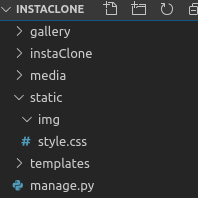

1. [Installation de Python-Django](../README.md)
2. [Création de l'app](creationappli.md)
3. [Structure](structure.md)
4. [Media](media.md)
5. [PostgreSQL](../postgresql.md)
6. [CSS](css.md)
7. [Formulaire](formulaire.md)
   

# Le CSS

Pour pouvoir ajouter du CSS et tout autre fichier statique, ajoutez ceci à la fin de `settings.py`:

    STATICFILES_DIRS = [
        os.path.join(BASE_DIR, "static")
    ]

Comme ça Django sait où aller chercher les fichiers (comme avec les médias)

Ajoutez ceci à votre arborescence (une dossier static, sous-dossier img et un fichier style.css):



Vous pourrez y mettre les images à inserer dans la template dans le dossier img.

maintenant copier-coller tout ceci dans `style.css`:


```
body {
    background: #f7c873;
    display: flex;
    flex-direction: column;
    align-items: center;
    color: #434343;
}

.logo {
    height: 350px;
    align-self: center;
}

.logo img {
    height: 100%;
}
button {
    font-weight: bold;
    background-color:black;
    color:white;
    padding: 2px 10px;
    border:none;
    box-shadow: 0px 0px 3px 0px white;
    border-radius: 10px;
    transition: background-color 0.3s ease-in,color 0.3s ease-in,box-shadow 0.3s ease-in;
    cursor: pointer;
}
button:hover {
    background-color:white;
    color:black;
    box-shadow: 0px 0px 5px 1px black;
}
.content {
    width: 80%;
}
input[type='file'] {
    width:0.1px;
    height: 0.1px;
    position: absolute;
    overflow: hidden;
}
label[for='id_cover'] {
    background-color:#434343;
    padding: 5px 40px;
    color:white;
    border-radius: 5px;
    cursor:pointer; 
}
.gallery {
    display:grid;
    grid-template-columns: 1fr 1fr 1fr 1fr 1fr 1fr 1fr;
    grid-column-gap: 30px;
}
.gallery img {
    width: 100%;
    border-radius: 5px;
    height: 10vw;
}

.gallery h2 {

    text-align: center;
    border-bottom: 3px groove rgba(67,67,67,0.2); 
    padding-bottom: 5px;
    
}

.photoAdd {
    position: absolute;
    right: 20px;
    top: 20px;
    height: 70px;
    width: 70px;
}

.photoAdd img {
    width: 100%;
    height: 100%;
}
.gallery h2{
    text-align: center;
    border-bottom: 3px groove rgba(67,67,67,0.2); 
    padding-bottom: 5px;
}
.vote a {
    margin-left:5px;
    text-decoration: none;
    color:black
}
.vote .like:hover {
    color: blue;
}
.vote .dislike:hover {
    color: red;
}
.vote span {
    margin-left:2px;
}
form {
    border: 5px solid  rgba(67,67,67,0.5); 
    text-align: center;
    padding: 20px;
    width: 90%;
}

footer {
    position: absolute;
    bottom: 0;
}

.mb-3{
    margin-bottom:30px
}

#id_title {
    height: 20px;
}

@media screen and (max-width:900px){
    .gallery {
        grid-template-columns: 1fr 1fr 1fr 1fr 1fr  !important;
    }
}

@media screen and (max-width:1300px){
    .gallery {
        grid-template-columns:1fr 1fr 1fr 1fr 1fr 1fr;
    }
}
@media screen and (max-width:600px){
    .gallery {
        grid-template-columns: 1fr 1fr  !important;
    }
    .gallery img {
        height: 25vw;
    }
}
@media screen and (max-width:300px){
    .gallery {
        grid-template-columns:1fr  !important;
    }
    .gallery img {
        height: 55vw;
    }
}

```

et copier les deux images ([image 1](img/addpic.png) [image 2](img/logo.png) dans static/img

Parfait, maintenant il n'y a plus qu'à lier le css avec la template de base en y ajoutant ceci et le tour est joué:


- le lien vers le css dans la balise `<head>`
```
 
    <link rel="stylesheet" type="text/css" href="">
```
- le logo juste après l'ouverture de la balise `body`:
```
   <a class="logo" href=""></a>
```

et juste en dessous de ça un "block" 
addPhoto vide pour y insérer le bouton d'ajout seulement dans l'index(le bloque restera vide dans les autres templates ):

    


comme ça dans la template `index.html`, on ajoute:

```




    <a class="photoAdd" href="#">
        
    </a>


```

l'icône viendra s'insérer là où on a défini le block dans `base.html`. Il ne mène nul part pour l'instant car nous devons créer la partie "upload" dans post.html


Tu peux maintenant passer au formulaire de ton app : [Formulaire](formulaire.md)
