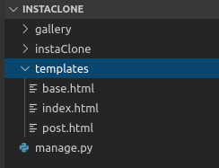
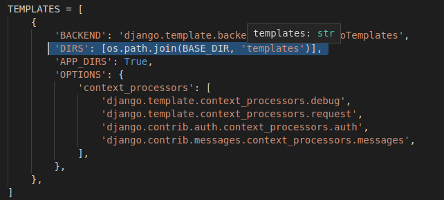
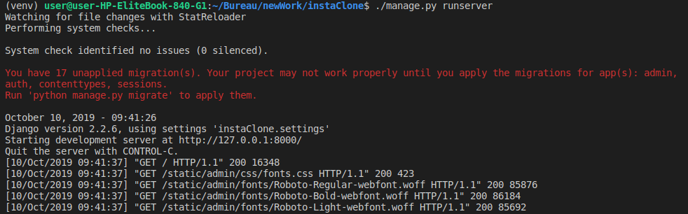
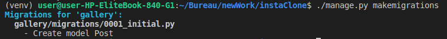

# l'arborescence du projet

Quand on lance un projet, un dossier se crée, ainsi qu'un sous-dossier du même nom. 

Si vous êtes curieux, je vous invite à lire ce qui suit. Sinon, scrollez jusqu'à l'image du paresseux. 


à la racine du projet, on a donc `manage.py`, qui est le script de gestion du projet, et qu'on va appeler à chaque fois qu'on veut faire tourner le serveur. 

Dans le sous-dossier du projet, on y voit `__init__.py`, un fichier qui initialise un paquet et dit à python de traiter les sous-dossiers comme des modules (en gros). le fichier `settings.py` contient toute la configuration de base du projet, et `urls.py` la configuration des urls. On ne s'occupe pas de `wsgi.py` pour le moment, c'est pour déployer le projet sur d'autres serveurs.


# L'instaClone

Ouf, la base de donnée et le projet sont installés! Passons à la partie plus fun et créons un clone (assez modeste) d'Instagram. 

# Création d'application

Un projet regroupe des applications, qui font chacune quelque chose de différent (un blog, une application ecommerce, etc). Ces applications vivent à la racine du projet Django (où se trouve le fichier `manage.py`).
On va donc lancer la commande pour créer une application à la racine: 

    ./manage.py startapp gallery


Après avoir rafraîchi vos dossiers, vous devriez y trouver l'application


Allons un peu fouiller dans celui-ci:


Tout d'abord, on y voit un dossier "migrations", qui permet à Django de migrer d'un coup de baguette magique le code python à la base de donnée. Ensuite, nous avons `admin.py` dont le code permet d'ajoutez, supprimer, et modifier du contenu dans l'interface admin de Django. `apps.py` permet la configuration spécifique à l'application. Il reste `models.py` et `views.py`, où nous mettrons respectivement le code relatif à la base de donnée et celui de la gestion des requêtes/réponses. Mais où allons nous mettre le code HTML, les templates? Vous allez voir :) 


Coucou toi! Bien dormi? On reprend! 


Pour que l'application fonctionne bien, on l'indique dans `settings.py` dans le dossier du projet:


# les fichiers template

On va commencer par créer les fichier templates, qui contiendront l'HTML ainsi que le code de la template engine de Django. Créez cette arborescence: 



Pour que django les retrouve quand on les appelle, il va falloir lui indiquer où aller dans `settings.py`: 



dans le fichier `index.html` qu'on vient de créer, on va afficher un simple 

    <h1>Hello World</h1>

# La page d'accueil

Pour le petit rappel, les fichiers Views sont à 
Django ce que les controlleurs sont à Laravel. C'est à dire qu'il sert d'entremetteur entre les requêtes et les réponses. Notre projet ici ne comporte qu'une application, celle de l'instaClone, donc nous ne mettrons rien dans le fichier `views.py` du projet, mais bien dans celui de l'application (`gallery/views.py`). 

On va faire simple au départ, sans données externes, pour comprendre la base, on va importer le module 'render', qui permettra donc d'afficher la template `index.html`:


Par contre, pour les URLS, dont nous devons passer par le fichier `urls.py` du dossier projet.

maintenant que l'URL est configuré et que le `views.py` renvoie la template, vous pouvez tester cela:

    ./manage.py runserver

et vous devriez avoir "hello world" quand vous cliquez sur http://127.0.0.1:8000/

# La page pour poster des photos

nous allons maintenant préparer la page d'upload, et le lien vers celle-ci.

Ajoutons d'abord le lien dans `urls.py`:

      path('post/', views.post, name="post")


quand on tapera http://127.0.0.1:8000/post ou qu'on cliquera sur un lien qui s'y dirige, cela appelera la fonction "post" dans `views.py`, qui renverra le template `post.html` 

il faut donc définir celle-ci:

    def post(request):
        return render(request, 'post.html')

Ecrivez ce que vous voulez dans `post.html`. Pour voir si ça marche, rdv sur http://127.0.0.1:8000/post

Si ça marche, on peut continuer (sinon, demandez à Corentin). 

On va faire un dernier truc assez basique avant de commencer les choses sérieuses: un lien de la page d'accueil vers la page post, comme ça vous allez faire vos premiers pas avec la template engine de Django. Dans vos urls, vous avez défini le lien vers le post comme ceci:

     path('post/', views.post, name="post")


vous avez donné un nom au lien:

    name="post"

ce qui vous sera utile pour les templates.

et plus au dessus vous avez défini le nom de l'app:

    app_name="gallery"

grace à cela ( et au tag de la template engine pour y insérer des données -->  ), vous allez pouvoir ajouter facilement des liens. 

`index.html` : 

    <h1>Hello World</h1>

    <a href=""> clique ici pour poster </a>

Vous avez pu définir l'url avec le nom de l'app, suivi de deux points et du nom que vous avez donné au lien. Vérifiez si ça marche :)

# la template de base

Pour faire simple, nous allons créer un template de base qu'on importera dans chaque template:

`base.html`:

```
<!DOCTYPE html>
<html lang="en">
<head>
    <meta charset="UTF-8">
    <meta name="viewport" content="width=device-width, initial-scale=1.0">
    <meta http-equiv="X-UA-Compatible" content="ie=edge">

    <title>  InstaClone  </title>
</head>
<body>

    <div class="content">
          
    </div>

<footer> &copy; Becode </footer> 
</body>
</html>
```

Dès que vous voyez les tags de la template engine, c'est qu'on peut y ajoutez du contenu différent:

``` html
<div class="content">

      

</div>
```
c'est ici qu'on inserera le contenu de nos différentes pages. Voici comment importer le layout de base et y ajouter du contenu:

```html



 InstaClone | Image Gallery 



<h1>Hello World</h1>

<a href=""> clique ici pour poster </a>



```

regardez le résultat et faites la même chose pour `post.html`. Il n'y a pas une grande différence pour le moment, mais si vous voyez le footer, c'est que ça fonctionne

`post.html`: 

```


 InstaClone | Image Upload 



<h1>La page des posts</h1>


``` 

# Ajoutez des médias

On arrive enfin à la partie plus visuel: l'ajout de médias. Il faut tout d'abord définir où vont être sauvegardées les images. Ensuite, on crée un dossier media et sous-dossier images à la racine. 

Après il faut ajouter dans `settings.py` le chemin des media_url (les liens des médias à travers http), et des media_root(les les liens des médias sauvegardés sur ordinateur)

```
MEDIA_URL = '/media/'
MEDIA_ROOT = os.path.join(BASE_DIR, 'media')
```

Il reste encore quelques configurations, cette fois dans l'`urls.py` du projet. On importe le module settings:

```
from django.conf import settings
```

et on ajoute ceci pour stocker les images en développement: 

```
if settings.DEBUG: 
    urlpatterns += static(settings.MEDIA_URL, document_root=settings.MEDIA_ROOT)
```


Nous allons maintenant enfin pouvoir créer le modèle de l'application qui communiquera avec la base de données pour afficher et stocker les images: 

`models.py`

```
from django.db import models

class Post(models.Model):
    title = models.TextField()
    cover = models.ImageField(upload_to='images/')
```

Nous avons donc importé le module "models" qui rend tout cela possible. La classe "Post" sera transferée vers postgresql grâce à la commande de migration, avec comme champs "title" et "cover", qui sera sous forme d'image.  

Il faut d'ailleurs importer Pillow pour que cela fonctionne. C'est une librairie Python qui gère les images:

    $ pip install pillow


# Petit retour en arrière.... 

Quand vous avez lancé le serveur, vous avez surement remarqué quelque chose de bizarre dans le terminal



les 17 migrations non-effectuées font parties des base de données propres à Django. Nous allons les migrer en même temps que le modèle que nous venons de créer:

    ./manage.py makemigrations

Vous devriez voir ceci dans le terminal:




Soyez curieux et aller voir le fichier généré dans migrations. Vous pouvez maintenant finaliser la migration en tapant:

    ./manage.py migrate

Pour vérifier si tout a fonctionné, allez sur pgadmin3, suivez ce chemin:

    mydb>schemas>public>tables>gallery_post

Clique droit + view data, et vous pourrez voir les champs que vous avez créés. 

# Modification des views

Nous voulons maintenant créer plus que des pages sans dynamisme et sans âme. La première chose à faire est d'afficher des images sur la page d'accueil. Le problème c'est que nous n'avons encore aucune image dans la base de données! Comment faire? Tout simplement en permettant à l'interface admin de poster des photos: 

`admin.py`:

```
from django.contrib import admin

from .models import Post

admin.site.register(Post)
```

pour pouvoir se connecter sur l'admin, on crée d'abord un superuser:

    ./manage.py createsuper

la commande va vous demander un nom, une adresse email et un mot de passe. Le mot de passe ne peut pas être trop simple, à moins de modifier les configs dans settings.py, mais pour le moment, ça sera plus simple d'avoir un mot de passe compliqué :) 

maintenant rdv sur http://127.0.0.1:8000/admin/ 
pour vous connecter avec votre nouveau superuser. Vous serez dirigez ici:


Félicitation, vous pouvez maintenant ajouter des images

# Des classes à la place des fonctions


Pour pouvoir afficher facilement des images en appelant le modèle, il existe des modules pour nous rendre la vie plus facile. Voici ce que nous mettrons dans `views.py` à la place des fonctions qui renvoient simplement des templates:

```
from django.shortcuts import render
from django.views import generic
from .models import Post

class home(generic.ListView):
    model = Post
    template_name="index.html"

def post(request):
    return render(request, 'post.html')

```

On garde la fonction post pour le moment et importe donc 2 choses :

- la classe Post du modèle qui contient la base de données.
- le module "generic" qui permettra grâce à le méthode ListView l'itération de chaque image de la classe Post pour l'afficher sur la template `index.html`

Vu que nous avons maintenant des classes, il va falloir changer légèrement l'`urls.py`:

    path('', views.home.as_view(), name="home"),

on va simplement ajouter .as_view() car home est maintenant une classe dont une certaine méthode est appelée. 

S'il n'y a pas de soucis quand on relance le serveur, c'est bien, mais par contre le visuel ne change pas car nous n'avons rien modifié dans la template `index.html`. C'est là que la template engine refait son apparition:

`index.html`:
```


<ul>



    <li>
        <a href="#">
        
        </a>
        <h2>{{ post.title }}</h2>
    </li>



</ul>


```
On remplace donc ce qu'il y avait dans le block content par ce qui a au dessus. Concrètement, l'object_list est l'objet généré par la méthode as_view() et qui contient toutes les données du modèle Post. On itère donc à travers chaque entrée et on recupère l'url (post.cover.url) pour la source de l'image, et le titre. 

Bien sûr pour l'instant c'est moche, et les images sont sûrement milles fois trop grandes. C'est pourquoi on va rajouter du CSS (là vous pourrez faire du copier-coller en toute impunité, n'ayez crainte)

Pour pouvoir ajouter du CSS et tout autre fichier statique, ajoutez ceci à la fin de `settings.py`:

    STATICFILES_DIRS = [
        os.path.join(BASE_DIR, "static")
    ]

Comme ça Django sait où aller chercher les fichiers (comme avec les médias)

Ajoutez ceci à votre arborescence (une dossier static, sous-dossier img et un fichier style.css):


Vous pourrez y mettre les images à inserer dans la template dans le dossier img.

maintenant copier-coller tout ceci dans `style.css`:


```
body {
    background: #f7c873;
    display: flex;
    flex-direction: column;
    align-items: center;
    justify-content: center;
    color: #434343;
}

.logo {
    height: 350px;
    align-self: center;
}

.logo img {
    height: 100%;
}

.content {
    width: 80%;
    display: flex;
    justify-content: center;
    overflow: hidden;
}

.content ul {
    padding: auto;
    display: inline-flex;
    flex-wrap: wrap;
    align-content: flex-start;
    margin: auto;
    justify-content: center;
   
    list-style-type: none;
}

.content ul li {
    display: flex;
    flex-direction: column;
    margin: 10px;
    height: 250px;
    width: 250px;
}

.content ul li a {
    height: 200px;
    overflow: hidden;
}

.content ul img {
    width: 100%;
    border-radius: 5px;
}

.content ul h2 {
    text-align: center;
    border-bottom: 3px groove rgba(67,67,67,0.2); 
    padding-bottom: 5px;
}

.photoAdd {
    position: absolute;
    right: 20px;
    top: 20px;
    height: 70px;
    width: 70px;
}

.photoAdd img {
    width: 100%;
    height: 100%;
}

form {
    border: 5px solid  rgba(67,67,67,0.5); 
    text-align: center;
    padding: 20px;
    width: 90%;
}

footer {
    position: absolute;
    bottom: 0;
}

#id_title {
    height: 20px;
}
```

et copier les deux images (ajoutez lien vers images dans repo) dans static/img

Parfait, maintenant il n'y a plus qu'à lier le css avec la template de base en y ajoutant ceci et le tour est joué:


- le lien vers le css dans la balise `<head>`
```
 
    <link rel="stylesheet" type="text/css" href="">
```
- le logo juste après l'ouverture de la balise `body`:

```
   <a class="logo" href=""></a>

```

et juste en dessous de ça un bloque addPhoto vide pour y ajouter quelque chose dans l'index:

    


comme ça dans la template `index.html`, on ajoute:

```




    <a class="photoAdd" href="#">
        
    </a>


```

l'icône viendra s'insérer là où on a défini le block dans `base.html`. Il ne mène nul part pour l'instant car nous devons créer la partie "upload" dans post.html

# les formulaires

Pour pouvoir ajoutez des éléments, il va falloir créer un formulaire. Django a prévu le coup, et il nous suffit de créer un nouveau fichier `forms.py` et d'y ajoutez 3 choses:

- un import du module forms de Django:

    from django import forms

- un import du modèle of course:

    from .models import Post

- et une classe qui se base sur un modèle du module forms:

```
class PostForm(forms.ModelForm):

    class Meta:
        model = Post
        title = forms.CharField(max_length=100)
        fields = ['cover', 'title']
```

Après ça, on crée le lien avec views.py en créant une autre classe. Mais d'abord, il faut encore importer quelques trucs!

- la classe PostForm qu'on vient de créer:

    from .forms import PostForm 

- le module reverse_lazy pour indiquer où se rediriger une fois que la requête est exécutée:

    from django.urls import reverse_lazy 

on peut maintenant créer la classe:

```
class CreatePostView(generic.CreateView): 
    model = Post
    form_class = PostForm
    template_name = 'post.html'
    success_url = reverse_lazy('gallery:index')
```

il faudra bien sûr editer l'url dans `urls.py` pour refleter la nouvelle classe:

    path('post/', views.CreatePostView.as_view(), name='add_post')

et éditer la template `post.html` pour y afficher le formulaire:

```


 InstaClone | Image Upload 





<form method="post" enctype="multipart/form-data">
<h1> Ajoute une photo </h1>
  
  {{ form.as_p }}
  <button type="submit">OK</button>
</form>



```

Pour terminer, retournez sur le template `index.html` et ajoutez-y le lien vers la page d'upload sur l'icone:

```


<a class="photoAdd" href="#">
    
</a>


```

Et voilà! 
