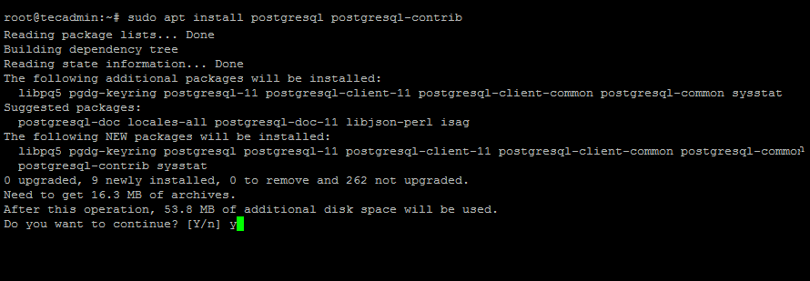

# La database postgreSQL

Qui est ce bel éléphant qui pose son regard serein sur Django, me diras-tu ?

Ce bel éléphant, c'est postgreSQL, une database relationnelle open-source.

C'est la database la plus courante quand on travaille avec Django.

## Installation

Si tu es sur ubuntu, tape ceçi :

    sudo apt-get update

    sudo apt-get install postgresql postgresql-contrib

Si tu es sur un autre système d'exploitation, tape celà : 

    sudo apt-get install postgresql postgresql-client 

PostgresQl va donc s'installer , créer une base de donnée et un utilisateur `superuser`.

Toutes les opérations d'administration se font, au départ, avec l'utilisateur `postgres`. À la fin de l'installation, celui-ci ne possède pas de mot de passe. La première chose à faire sera de créer un nouvel utilisateur, mais pour ce faire, il faut se connecter au moins une fois en tant qu'utilisateur postgres. Pour devenir postgres et faire les opérations d'administration qui suivent, tape ceçi pour te connecter à `postgres` : 

    sudo -i -u postgres 
    Password: 

les commandes `exit` ou `ctrl+d` te permettront, à la fin de cette session d'administration dans PostgreSQL, de reprendre la main en tant qu'utilisateur du système. 

## Création de la database

Sur Ubuntu : 

    sudo -u postgres createdb ma_db

Sur les autres systèmes : 

    createdb ma_db

Créer un nouvel utilisateur et donne lui accès à la nouvelle database.

    $ sudo -u postgres psql 
    postgres=# CREATE USER mon_user WITH PASSWORD 'mon_password';
    CREATE ROLE
    postgres=# GRANT ALL ON DATABASE ma_db TO mon_user;
    GRANT

## Installation de l’adaptateur Django-PostgresQL

Tu te rappelles de pip ? L'utilitaire de gestion de packages pour python ?

Lui, en tout cas, ne t'a pas oublié. Tu vas pouvoir faire appel à lui pour installer l'adaptateur `psycopg2`.

Sans trop entrer dans les détails, l'adaptateur sert à connecter Django à la database afin qu'ils puissent communiquer aisément ce qui te facilitera la tâche.

`Psycopg2` étant l'adaptateur python-django le plus populaire, c'est donc lui que nous allons utiliser.

>Si tu veux creuser le sujet : https://pypi.org/project/psycopg2/
>
> Et pour la théorie : https://link.springer.com/referenceworkentry/10.1007%2F978-0-387-39940-9_1182

Tape ceçi :

    pip install psycopg2-binary

Si ça ne fonctionne pas, essaye ceçi : 

    pip install --upgrade setuptools

Et retente l'installation.

## Linker ta database à ton projet

Va maintenant dans le fichier `settings.py` de ton projet django, cherche ma section `DATABES` et modifie les `NAME`, `USER` et `PASSWORD` afin qu'ils correspondent à ceux que tu as utilisé pour ta database :

    DATABASES = {
        'default': {
            'ENGINE': 'django.db.backends.postgresql_psycopg2',
            'NAME': 'le_nom_de_ta_db',
            'USER': 'ton_user_name',
            'PASSWORD': 'ton_password',
            'HOST': 'localhost',
            'PORT': '',
        }
    }

## Installation pgAdmin

Si tu as déjà utilisé mySQL, tu connais certainement `phpMyAdmin`.

Si tu ne connais pas, c'est une interface graphique utilisateur qui te permet de gérer tes databases sans devoir passer par des lignes de codes. (même si tu conserves la possibilité de le faire)

`pgAdmin` est l'équivalent de `phpMyAdmin` pour `postgreSQL`.

    verifier que ça fonctionne (dans schéma → table)
